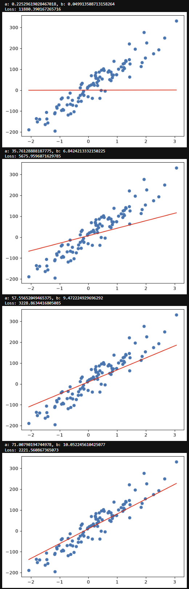

# Linear Regression: Analytical Solution vs. Gradient Descent

A small machine learning project exploring two different ways to find the optimal parameters for a linear regression model:

1. **Analytical solution**
2. **Gradient descent**

The goal of the project was to understand the mathematics behind linear regression and gradient-based optimization, and implement both approaches in Python.

## Analytical Solution

For a linear model

$$
\hat{y} = ax + b
$$

the optimal slope $a$ and intercept $b$ can be found directly by minimizing the sum of squared errors.
 
$$
L(a,b) = \sum_{i=1}^{n} (y_i - \hat{y})^2
$$

[The notebook](notebook.ipynb) derives the analytical solution from the partial derivatives of the loss function and plots the resulting line using NumPy and matplotlib.

## Gradient Descent

The second approach finds the parameters iteratively using gradient descent.

The loss function is defined as Mean Squared Error (MSE):

$$
L(a,b) = \frac{1}{n}\sum_{i=1}^{n}(y_i-\hat{y})^2
$$

The gradients with respect to $a$ and $b$ are calculated manually, and the parameters are updated using:

$$
a_{t+1} = a_t - \eta\frac{\partial L}{\partial a}
$$

$$
b_{t+1} = b_t - \eta\frac{\partial L}{\partial b}
$$

*Evolution of the model parameters, fitted regression line, and loss during gradient descent.*

## Implementation

The project uses:

* Python
* NumPy
* Matplotlib
* Scikit-learn (`make_regression`, dataset)

The dataset is generated using `make_regression`, after which the optimal parameters are calculated and visualized.

## What I Learned

* How to derive the analytical solution for linear regression
* How partial derivatives lead to the optimal parameters
* How Mean Squared Error is used as a loss function
* How gradients are calculated for model parameters
* How gradient descent iteratively minimizes a loss function
* The relationship between analytical optimization and gradient-based optimization

## Notebook

The complete implementation, mathematical derivations and visualizations are available in the Jupyter Notebook:

[`notebook.ipynb`](notebook.ipynb)

